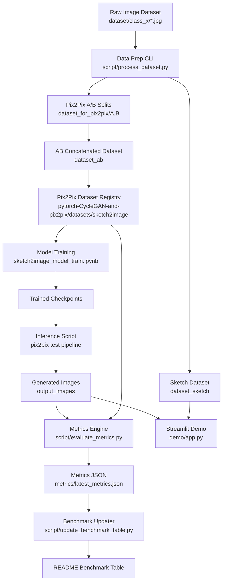

# Sketch2Image: Sketch-to-Photoreal Translation with Pix2Pix

[](https://www.python.org/)
[](https://phillipi.github.io/pix2pix/)
[](LICENSE)
[](.github/workflows/ci.yml)
[](SECURITY.md)

Sketch2Image is an end-to-end computer vision project that translates hand-drawn sketches into realistic images using a conditional GAN (Pix2Pix). It includes reproducible data preparation, quality evaluation (FID/LPIPS/SSIM), benchmark automation, and an interactive Streamlit demo.

## Why This Repo Is Flagship-Ready

- Complete workflow: data prep, training, inference, evaluation, and demo.
- Reproducibility-first scripts with deterministic split controls.
- Works in both full-dataset mode and single before/after image mode.
- CI checks, security policy, contribution guide, and citation metadata included.

## Architecture (Mermaid)



## Quick Start (Fastest Path)

### 1) Install

```bash
git clone https://github.com/prashantsingh5/Sketch_2_image.git
cd Sketch_2_image
python -m venv .venv
```

Activate venv:

```powershell
. .\.venv\Scripts\Activate.ps1
```

```bash
source .venv/bin/activate
```

```bash
pip install -r requirements.txt
python script/doctor.py
```

### 2) Run Single-Pair Evaluation (No Dataset Setup Needed)

Put your images at:

- `assets/sample/before.jpg`
- `assets/sample/after.jpg`

Then run:

```bash
python script/run_full_eval.py --real-image assets/sample/before.jpg --generated-image assets/sample/after.jpg --experiment "Single Pair Smoke Test" --split test
```

This computes `FID`, `LPIPS`, `SSIM` and auto-updates the benchmark table in this README.

### 3) Launch Live Demo

```bash
streamlit run demo/app.py
```

Demo modes:

- `Folders`: browse full before/after datasets.
- `Upload single pair`: drag and drop one before/after pair.

## Full Pipeline (Dataset Mode)

### 1) Input dataset format

```text
dataset/
|-- bedroom/
|   |-- image_001.jpg
|   `-- image_002.jpg
`-- kitchen/
    |-- image_101.jpg
    `-- image_102.jpg
```

### 2) Build Pix2Pix dataset artifacts

```bash
python script/process_dataset.py --base-folder . --dataset-dir dataset --pix2pix-repo pytorch-CycleGAN-and-pix2pix --dataset-name sketch2image
```

Optional split control:

```bash
python script/process_dataset.py --val-ratio 0.1 --test-ratio 0.05 --seed 42
```

### 3) Train and inference

- Run `sketch2image_model_train.ipynb` in order.
- Run inference from `pytorch-CycleGAN-and-pix2pix/` (for example via your test script).

### 4) Evaluate and benchmark

```bash
python script/run_full_eval.py --real-dir dataset_for_pix2pix/B/val --generated-dir pytorch-CycleGAN-and-pix2pix/output_images --experiment "Baseline Pix2Pix (default config)" --split val
```

Metric interpretation:

- `FID`: lower is better.
- `LPIPS`: lower is better.
- `SSIM`: higher is better.

## Benchmark Table

| Experiment | Dataset Split | FID ↓ | LPIPS ↓ | SSIM ↑ | Notes |
|---|---|---:|---:|---:|---|
| Baseline Pix2Pix (default config) | val | TBD | TBD | TBD | Run `script/run_full_eval.py` in dataset mode |
| Single Pair Smoke Test | test | TBD | TBD | TBD | Run `script/run_full_eval.py` in single-pair mode |
| Tuned Run (example) | val | TBD | TBD | TBD | Add hyperparameter notes |

## Example Result

### Input Sketch


### Generated Image


## Repository Structure

```text
.
|-- README.md
|-- CONTRIBUTING.md
|-- PROJECT_ROADMAP.md
|-- SECURITY.md
|-- CITATION.cff
|-- requirements.txt
|-- sketch2image_model_train.ipynb
|-- assets/
|   `-- sample/
|       `-- README.md
|-- demo/
|   `-- app.py
|-- script/
|   |-- process_dataset.py
|   |-- evaluate_metrics.py
|   |-- update_benchmark_table.py
|   |-- run_full_eval.py
|   `-- doctor.py
`-- pytorch-CycleGAN-and-pix2pix/
```

## Project Hygiene

- Security policy: `SECURITY.md`
- Citation metadata: `CITATION.cff`
- Contribution guide: `CONTRIBUTING.md`
- Planned milestones: `PROJECT_ROADMAP.md`

## Acknowledgments

- Pix2Pix paper and ecosystem.
- PyTorch community.
- `pytorch-CycleGAN-and-pix2pix` maintainers.

## Author

Prashant Singh  
Contact: `prashantsingha96@gmail.com`
